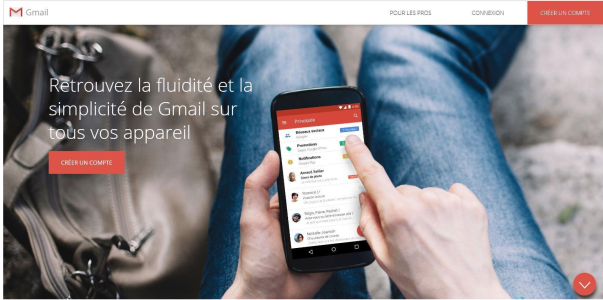
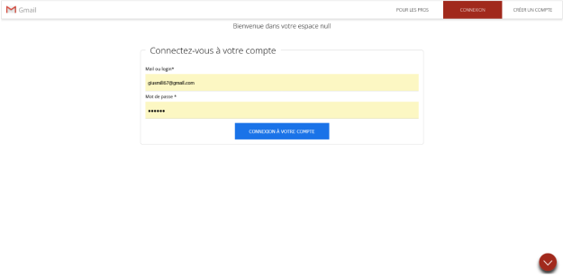
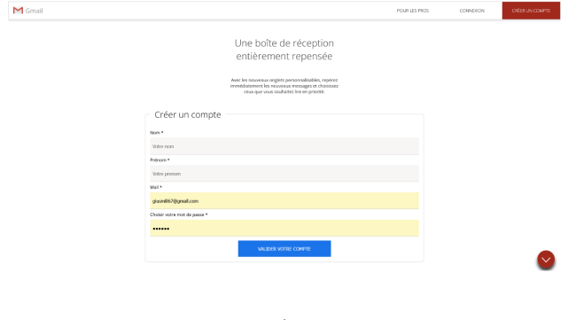

# Création d'un "clone" de Gmail:
## Première étape: Création d'une version statique de la page:
lien vers le déploiement de la page: https://ounissasadaoui.github.io/Gmail/
* on commence par la page d'acceuil, elle doit ressembler à ceci:
 
* La page de connexion sera celle-ci: 
 
* Quand à la page de création de compte, ça sera celle-ci:


On commence par la mise en place du code HTML de la page.
on utilise une navbar pour les boutons de navigation du haut de la page, ainsi que des références aux différentes sections avec des balises comme celle-ci:
```html
            <a href="#home_page">Gmail</a>

```
* Passons au css de la page:
Une fois le squelette html prêt, on peut commencer à mettre en forme en css.

  J'ai fait le fait le choix de diviser la mise en page css en 3 parties:
  * main: pour le reset de la page
  * forms: pour l'apparence des formulaires
  * theme : pour l'apparence générale du projet

  Ppour ne faire qu'une seule inclusion dans la page d'index, je mets des liens d'import dans le main.css et je n'ai alors besoin que d'une ligne d'inclusion de css:
  ```html 
      <link rel="stylesheet" href="./CSS/main.css">
```
les lignes d'import dans le main.css sont ainsi faites:
```css
@import url("./forms.css");
@import url("./theme.css");
```
Ensuite, pour ce qui est des pages de connexion et de création de compte:
 * La page de création de compte est incluse dans la page d'index principale.
 * La page de connexion est une page html indépendante, à laquelle on renvoit l'utilisateur dès lors qu'il sélectionne l'option de connexion dans la barre de navigation:
 ```html 
             <a id="btn_connexion" href="connexion.html" target="_blank">Connexion</a>
```
### Création du favicon:
Comme d'habitude, avec le site: https://favicon.io/favicon-converter/

On inclus le webmanifest ainsi que les icones dans notre projet, en faisant en sorte de bien choisir les bons formats pour les icônes.

On ajoute aussi la ligne correspondant au manifest dans le head du html :
```html 
        <link rel="manifest" href="favicon/site.webmanifest">
```

Maintenant, avec ses modifications apportées, dans la fenêtre devTools, dans applications, on voit bien le manifeste avec les icônes.

## Deuxième étape: Création d'une version Dynamique de la page en PHP:

Pour parvenir à cela, on créé une page index.php, dans laquelle on copie-colle l'index.html.
Le but est de l'épurer au maximum, c'est pourquoi nous allons créer dans notre projet un répertoire "controller", on y mettra un "head.inc.php", contenant l'en-tête de notre projet.

Dans la page index.php, on n'aura alors qu'à ajouter les inclusions de fichiers importants. Comme ceci:
```php
include_once "./controller/head.inc.php"
```


  ce qu'il faut faire pour le php:

*Finir toutes mes classes, c'est à dire:
                           le controle de la session
                           le controle du token

*Faire bien mes redirections

*Refaire ma base de données sur ubuntu, pour que tout soit bien en place,
*Faire des scripts de liaison entre les deux 
*FINIR AVANT LA FIN DU COURS, akka anwali lfilm mebla igheblan

